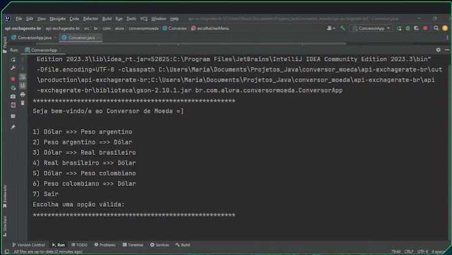

# Challenges ONE

É uma forma de implementar o Challenge Based Learning, ou seja, aprendizado baseado em desafios que a Apple ajudou a criar. É um mecanismo que permite que você se comprometa com a resolução de um problema e então investigue 
soluções com cursos, conteúdo e palestras, ou até mesmo com o conhecimento que você já tem! Finalmente, você vai agir e colocar o seu projeto no ar. Tudo isso enquanto comenta e ajuda em projetos de outros alunos e alunas.

## Consumo Api ExchangeRate
O o desafio atual, escolhemos a API "Exchange Rate API" por suas taxas de câmbio em tempo real, fornecendo informações precisas e atualizadas para nossas conversões de moeda. O melhor de tudo, é gratuito e fácil de usar!

## Objetivos do projeto

O objetivo principal deste challenge é que você viva a experiência de realizar um projeto real, tal como ocorre no dia a dia de uma pessoa desenvolvedora. Você terá a oportunidade de praticar os conceitos aprendidos nos cursos realizados até agora.

## Desafio proposto
construir um programa que faça uma interação com o usuário de forma textual, isso é via console, e que ele traga no mínimo seis opções de conversões de moedas. O usuário vai entrar com a opção que deseja dentro desse menu e 
depois disso vai informar qual é o valor que deseja converter. Ao final, você vai informar para ele o valor final já convertido e vai encerrar o programa.

## Resultado obtido

 